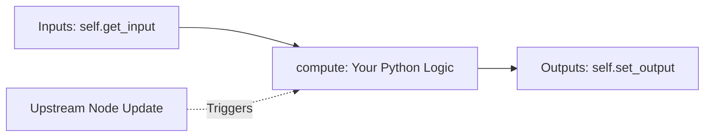

# How to Create a Simple Node in IngeTrazo Node Editor

This tutorial guides you step-by-step through creating a custom parametric node for **IngeTrazo Node Editor**. By following this guide, your node will automatically appear in the double-click search palette, connect to existing nodes, and bake directly into IngeTrazo's 3D CAD viewport.

---

## 🏗️ 1. Understanding Node Architecture

Every node in the editor is a Python class inheriting from [`NodeBase`](file:///C:/Users/pc/Documents/GitHub/IngeTrazoNodeEditor/engine.py#L120-L242).



The node execution lifecycle consists of three stages:
1. **Definition (`setup_ports`)**: Executed once during instantiation to declare input sockets and output pins.
2. **Execution (`compute`)**: Executed whenever upstream nodes change value or connections update.
3. **Registration (`@register_node`)**: Makes the node visible in the double-click / `Tab` search menu and category toolbars.

---

## 🎨 2. Node Metadata & Color Themes

Every node must define basic metadata attributes:

```python
from .engine import NodeBase, PortType
from .nodes_library import register_node

@register_node
class MyCustomNode(NodeBase):
    name = "My Custom Node"       # Title displayed on the node header
    category = "Math"             # Category grouping (Math, Point, Curve, Mesh...)
    description = "Brief description displayed in search popups and tooltips."
    header_color = "#d08770"      # Hex color for header card styling
```

### Standard Category Palettes
Use the established Nord design system palette for consistent visual grouping:

| Category | Header Color | Common Uses |
| :--- | :--- | :--- |
| **Input** | `#5e81ac` | Sliders, Booleans, Strings, Image Files |
| **Math** / **Logic** | `#d08770` | Arithmetic, formulas, conditionals, domains |
| **Point** | `#a3be8c` | Point coordinates, grids, deconstructors |
| **Vector** | `#8fbcbb` | Directions, normals, unit vectors |
| **Curve** | `#ebcb8b` | Lines, polylines, circles, arcs |
| **Solids** / **Surface** | `#b48ead` | Boxes, cylinders, extrusions, lofting |
| **Mesh** | `#f28b25` | 3D quad/triangle meshes, terrain relief |
| **Transform** | `#88c0d0` | Move, rotate, scale, orient |
| **Scene** / **Bake** | `#bf616a` | IngeTrazo viewport streaming and baking |

---

## 🔌 3. Defining Ports (`setup_ports`)

Declare input and output pins inside `setup_ports()`:

```python
def setup_ports(self) -> None:
    # self.add_input(name, port_type, default_value, description)
    self.add_input("Radius", PortType.NUMBER, 10.0, "Circle radius")
    self.add_input("Count", PortType.INTEGER, 8, "Number of divisions")

    # self.add_output(name, port_type, description)
    self.add_output("Points", PortType.POINT, "Calculated points")
```

### Available Port Types (`PortType`)
- `PortType.NUMBER`: Floating point numbers (`float`)
- `PortType.INTEGER`: Integer numbers (`int`)
- `PortType.BOOLEAN`: True/False flags (`bool`)
- `PortType.STRING`: Text strings (`str`)
- `PortType.POINT`: 3D coordinates (`Point3D`)
- `PortType.VECTOR`: 3D vectors (`Vector3D`)
- `PortType.CURVE`: Polylines or curves (`PolylineData`)
- `PortType.MESH`: 3D surfaces and solids (`MeshData`)
- `PortType.ANY`: Accepts any type (universal or lists)

---

## ⚙️ 4. Computation Logic (`compute`)

Implement your calculations inside `compute(self, context=None)`:

### Reading Inputs
Use `self.get_input(port_name, fallback_value)`. It automatically retrieves the upstream value if connected, or the default value if disconnected:
```python
radius = float(self.get_input("Radius", 10.0))
count = int(self.get_input("Count", 8))
```

### Writing Outputs
Use `self.set_output(port_name, calculated_value)`:
```python
self.set_output("Points", result_points)
```

### Error Handling
If an invalid input occurs (e.g., division by zero), set `self.error = str(ex)`. The node will highlight with a clear red border on canvas without crashing the application:
```python
def compute(self, context=None):
    try:
        val = float(self.get_input("Val", 1.0))
        if val == 0:
            raise ValueError("Val cannot be zero")
        self.error = None
        self.set_output("Result", 10.0 / val)
    except Exception as ex:
        self.error = str(ex)
        self.set_output("Result", 0.0)
```

---

## 🚀 5. Complete Step-by-Step Example: "Star Polygon" Node

Here is a complete, working example creating a 2D/3D Star Polygon mesh node:

```python
import math
from typing import Optional, Dict, Any, List

from .engine import NodeBase, PortType
from .models import Point3D, FaceData, EdgeData, MeshData
from .nodes_library import register_node


@register_node
class StarPolygonNode(NodeBase):
    name = "Star Polygon"
    category = "Curve"
    description = (
        "Generates a 2D star polygon with alternating inner and outer radii.\n"
        "Outputs both a closed boundary curve and a planar Mesh."
    )
    header_color = "#ebcb8b"

    def setup_ports(self) -> None:
        self.add_input("Center", PortType.POINT, Point3D(0.0, 0.0, 0.0), "Center location")
        self.add_input("Points Count", PortType.INTEGER, 5, "Number of star points (rays)")
        self.add_input("Outer Radius", PortType.NUMBER, 10.0, "Outer tip radius")
        self.add_input("Inner Radius", PortType.NUMBER, 4.0, "Inner valley radius")

        self.add_output("Mesh", PortType.MESH, "Planar star mesh")
        self.add_output("Points", PortType.ANY, "Perimeter vertex points")

    def compute(self, context: Optional[Dict[str, Any]] = None) -> None:
        try:
            # 1. Retrieve inputs
            center = self.get_input("Center", Point3D(0.0, 0.0, 0.0))
            if not isinstance(center, Point3D):
                center = Point3D(0.0, 0.0, 0.0)

            n_points = max(3, int(self.get_input("Points Count", 5)))
            r_outer = max(0.01, float(self.get_input("Outer Radius", 10.0)))
            r_inner = max(0.01, float(self.get_input("Inner Radius", 4.0)))

            # 2. Compute star vertices
            verts: List[Point3D] = []
            total_vertices = n_points * 2
            for i in range(total_vertices):
                angle = (math.pi * i) / n_points
                r = r_outer if (i % 2 == 0) else r_inner
                x = center.x + r * math.cos(angle)
                y = center.y + r * math.sin(angle)
                z = center.z
                verts.append(Point3D(x, y, z))

            # 3. Create wireframe edges
            edges: List[EdgeData] = []
            for i in range(total_vertices):
                nxt = (i + 1) % total_vertices
                edges.append(EdgeData(verts[i], verts[nxt], soft=False))

            # 4. Construct planar face and MeshData
            face = FaceData(vertices=verts)
            mesh = MeshData(
                faces=[face],
                edges=edges,
                name=f"Star_{n_points}"
            )

            # 5. Emit outputs
            self.error = None
            self.set_output("Mesh", mesh)
            self.set_output("Points", verts)

        except Exception as ex:
            self.error = str(ex)
            self.set_output("Mesh", MeshData())
            self.set_output("Points", [])
```

---

## 🧪 6. Testing Your Node

1. Save your code into [`nodes_library.py`](file:///C:/Users/pc/Documents/GitHub/IngeTrazoNodeEditor/nodes_library.py).
2. Launch IngeTrazo and open **Extensions ▸ Parametric Node Editor**.
3. Double-click on the canvas or press `Tab`.
4. Type your node's name (e.g. `Star Polygon`).
5. Place the node, connect a **Number Slider** into `Outer Radius`, and connect the `Mesh` output into an **IngeTrazo Output** node to view the result in real-time!
